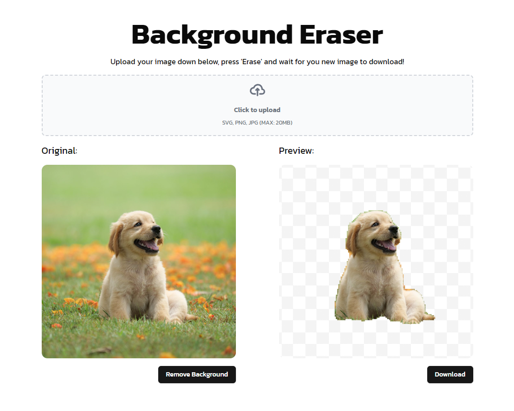

# Background Eraser

This repository is a small website together with a small backend that allows a user to upload an image and remove its background. 

## Prerequisites.
- Docker and docker-compose.
- The `Yolov8m-seg.onnx` model stored in the `/model/` folder.

## Stack
This project is a practice project of mine to build an application using Rust. One of the important aspects for me was to use a Neural Network. The backend therefore consists of a Rust API that is linked to an ONNX Runtime which makes an inference on a Yolov8 Segmentation Model. The API framework I used is Axum. The frontend is build in Svelte. 

## Deployment
There's an automated deployment action that is defined. This action simply removes any previous docker compose session and builds another up again. An important thing to note is to have the Yolo model stored somewhere and mount it correctly in the `docker-compose.yml`. Once that is done, you should be good to go.

